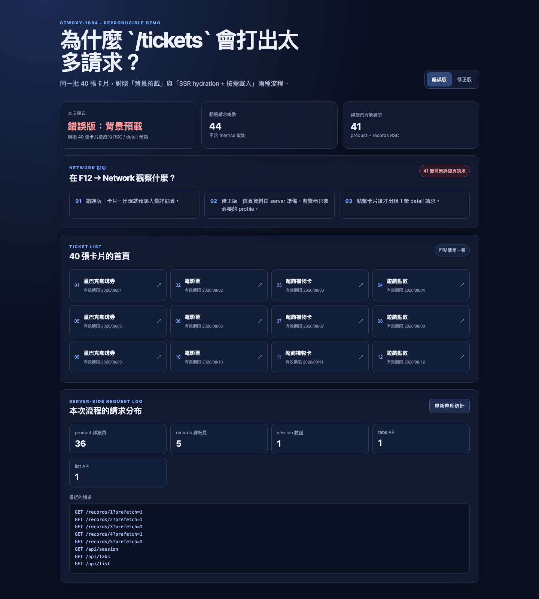
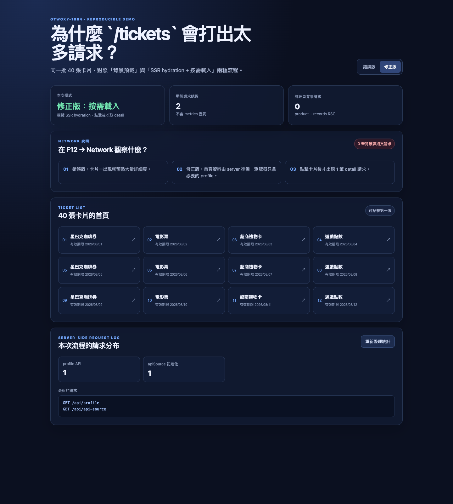

# Tickets WAF Request Demo

這是一個可重現 `/tickets` 首頁「請求次數太高」問題的最小 demo。它把同一批 40 張卡片分成兩種流程：

- **錯誤版 (`?mode=before`)**：模擬首頁載入時對 36 個商品詳細頁、5 個 records 詳細頁、session、tabs、list 一起發出背景請求。
- **修正版 (`?mode=after`)**：模擬 SSR 已準備 session/tab/list 後，瀏覽器只初始化 profile 與 apiSource；使用者點擊卡片後才取得 1 筆詳細資料。

## 執行

需要 Node.js 18 或更新版本：

```bash
npm start
```

開啟：

- http://127.0.0.1:4173/?mode=before
- http://127.0.0.1:4173/?mode=after

## 如何重現

1. 開啟錯誤版，按 `⌥⌘I`（Windows/Linux 為 `F12`）開啟 DevTools。
2. 到 **Network**，重新整理頁面，搜尋 `product` 或 `records`；可以看到大量背景詳細頁請求。
3. 切到修正版再重新整理；初始載入不會有背景詳細頁請求。
4. 點第一張卡片，這時才新增一筆 `/product/1?source=click`。

頁面下方的 **Server-side request log** 也會同步列出本次流程的請求分布，方便在沒有開 DevTools 的情況下閱讀結果。

## 預期結果

| 流程 | 背景詳細頁 | 初始動態 API | 點擊第一張卡片 |
| --- | ---: | ---: | ---: |
| 錯誤版 | 41 | session、tabs、list | 已先預熱 |
| 修正版 | 0 | profile、apiSource | 新增 1 筆 detail |

## 截圖





這個 demo 對應到 tickets 專案的 GTWGXY-1884 處理：關閉高數量連結預載、移除重複 session 驗證，以及將初始 tab/list 改為 SSR + React Query hydration。
